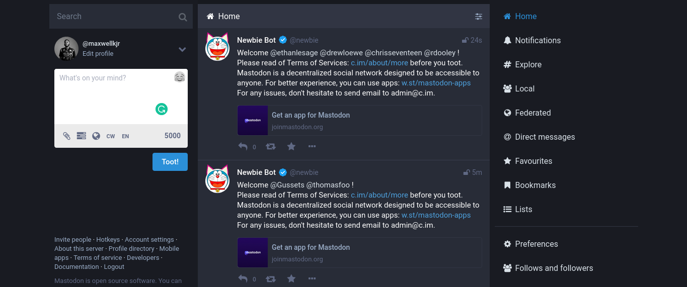

I am a fan of free and open source software (FOSS) and I try my best to use FOSS when they are available and offer a better experience than proprietery stuff. To be honest, the first time I heard about Mastodon was on 7th November, 2022, a few days/weeks after Elon Musk's acquisition of Twitter.

This was news to me but I did not want to be in a hurry to jump to conclusions about the new TikTok or whatever you would like to call it. Anyway, I will first answer the question "What is Mastodon?" and also share my experiences and first impressions with Mastodon on account creation and posting a few toots (tweets).

### What is Mastodon? Seriously.

Mastodon is a free and open source, decentralized social media alternative to Twitter. Two points to note: **Open Source** and **Decentralized.**

#### **Mastodon being Open Source**

In simple terms, this means that the codebase is free for everyone to see, that way you can be assured that your personal data, things you toot (lol), and share with others are not tracked or sold to other third parties, the way Google, Facebook, and even Twitter.

Mastodon being Open Source also means that anyone can get the code and build their own modified version or even help modify the existing codebase itself.

#### Mastodon being Decentralized

This means that there is no central server to store the data of users and no one company that is in charge of what goes on around the company. **_THE POWER IS IN YOU (THE USER'S) HANDS._**

### **First Impressions**

I will be blunt. Coming from platforms like Twitter, Facebook, TikTok, and other centralized social media platforms, the user creation process was not that pleasing to me. In fact, I gave up on the process because the fact that I had to choose my own server seemed so foreign to me. But I gave it another shot and I don't regret it.

#### How does Mastodon look?

After creating my account, the look and feel of Mastodon was great. It was like using Twitter in reverse and everything flipped around (I am yet to use the app because I still can't login on that).

I also found some things to be much better than what Twitter offers, for example: if I want to toot, the toot field is right there for me and I don't have to open up a modal for it but this is just my opinion, and the experience I would love to have throughout.

I am definitely sticking around with Mastodon and you should too.

I will be releasing another post, comparing Mastodon and Twitter, their pros and cons, and MORE!

Happy tweeting and tooting!
