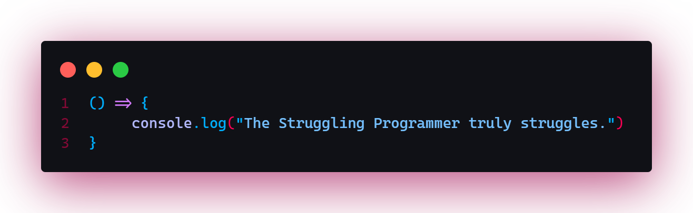
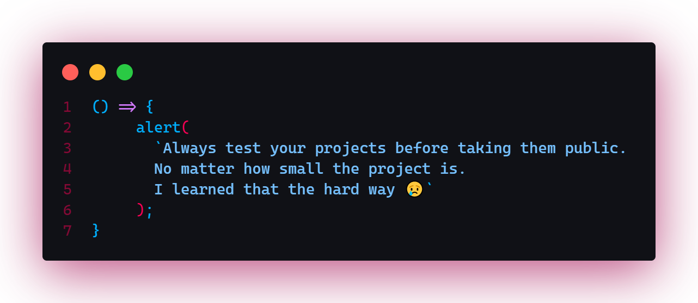

**NOTE:** The next 2 or 3 posts (this one included) will be more personal and not necessarily technical because I want you know me as a person first. A person who is prone to _error_ and make _stupid mistakes_, so consider these posts as life hacks. Are we clear? Okay, read along now.

#### Be careful with what you wish for 🙃

One of the main reasons I failed to use my website was that I undermined the true nature of what it takes to be a blogger and to be honest, I am glad that I did because it means that if I started writing content with no appropriate goal in mind then my blog would have been a mess.

Not knowing what it takes to be a blogger gave me time to read a number of blogs and study the craft. I won’t lie that I have been practicing my writing skills or anything like that but, I am now familiar with the most important things and what to avoid. Since this is not a post of how to become a blogger, I will stop right here.

#### Bugs! And a lot of them 🤦‍♂️

The other main reason why I was not able to write on/ my blog was bugs. The technologies I used to build this site are <a href=”https://gatsbjs.org” target=”_blank”>GatsbyJS</a>, which is a react framework, <a href=”https://graphql.org” target=”_blank”>GraphQL</a>, <a href=”https://netlify.com” target=”_blank”>Netlify</a> to host the front-end part of this website, <a href=”https://netlifycms.org” target=”_blank”>NetlifyCMS</a> to store and manage my posts, I mean it’s 2021 and not every website is built on WordPress. 😏

Anyway, the problem I had was that I was not able to keep my old posts when I decided to make updates to the entire website, and sadly, I came across this problem when I finally released the website and was ready to start writing.

Though I still went ahead and officially opened up the website, I was certain that there were a lot more features and content that I wanted to add.

> **LESSON**: Always test your projects before taking them public. No matter how small the project is, I learned that the hard way.

#### Walk with the times. Update!

The last main reason why my website looked unused was because I was not able to make a proper transition from Gatsby v2 to v3. I was lacking behind and rarely updated the technologies I was using despite being an impulsive updater 😅.

When I finally moved to Gatsby v3, I had another issue with some plugins that were only compatible with the previous version of Gatsby (v2). I now needed to find solutions and alternatives to those plugins.

Whenever I faced those issues, I always closed my editor or just went to another project. It was pretty sad and demotivating but eventually it all worked out.

If you are wondering on how I fixed the bugs then don’t worry because I am planning on sharing the experiences I had when creating this website starting with my inspirations, challenges, as well as in depth review of why I chose what I chose and why I did what I did.

Despite having a number of challenges, with the three I have described being the dominant ones, I was able to overcome some of them, and if you are someone who is just starting out, I hope you understand that making mistakes is normal and that things sometimes will not go according to plan just do your part and put in the effort. Eventually things will turn out alright!
